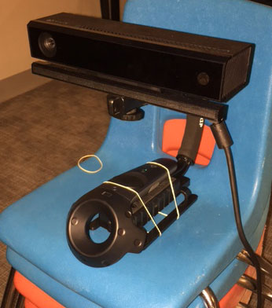
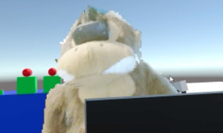

About
-----

This is a mostly working mixed reality setup, utilizing the Kinect. It does not require a green screen or post processing of video feeds. It works by rendering the output from the Kinect as point cloud (created from the depth and color cameras). The point cloud also has normals generated for it so we can accomplish some in game lighting on the avatar. Instead of rendering the entire point cloud, we render a bounding box of points. The bounding box is created using the user's head position and controller positions (ensuring that both fit within the box, and extending the box from the head down to the floor).

You will need one controller to act as the tracker for the kinect. The Vive is capable of tracking more than two controllers, so a third controller can be dedicated to tracking the Kinect. We set up a simple rig using a standard camera stabilizer.

If you can't spare an extra controller, you can set up the camera in a fixed position and not use the tracking features.

This project mostly uses hacked up bits of Microsoft's Unity Kinect example. The point cloud creation is fairly slow and won't be suitable to include in public builds, but may be useful for teams to produce their own mixed reality footage for marketing purposes and as a base to begin experimenting on.

Running the Example
-------------------

Ensure you have your kinect plugged in and load up the Example scene. You will want to have created some kind of rig like we have to hold the Kinect and a controller. Otherwise, position the controller and kinect as close togehter as you can. If your controllers are swapped from what we set them up as, you may need swap them or see the next section. Otherwise you should start to see something as soon as you hit play.

Setup
-----

In the Example scene, there is an object called RealityStream. On that there is a SmoothMotion component. Set 'Track To' to whatever controller you want to use for tracking the kinect.

Under that object there is KinectOrigin and then KinectView. On Kinect View make sure that MultiSourceManager is connected to the MultiFrameManager and attach the 'Camera Head' and 'Hands' (controllers) to the appropriate variables on the DepthSourceView. These ensure that the bounding box includes the head and hands listed there.

We also have a light attached to the left hand which you may want to remove. 

